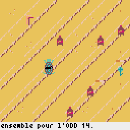
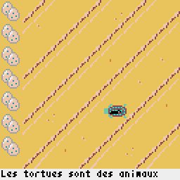
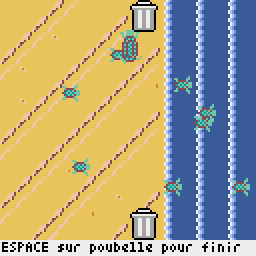

# The Trash Turtle - Nuit du C0de 2023, a 6h Hackathon

The theme was **bigger is better**.

*Version en français dessous*

Welcome to the beach! You're **The Trash Turtle**, a mother cleaning up trash from the beach so her newborn babies can safely hatch and make the treck to the ocean.

Your goal is to **pick up the most peices of trash** possible, becasue with more trash picked up, more babies will hatch and make it to the ocean!

We fit the theme by making the trash bag on your back get bigger and bigger as you pick up more trash, and the more trash the more babies hatch! So a **bigger** trash bag, means a **better** ending!

## Mechanics

- Screens are laid out in a line, and you move from the hatching grounds all the way on the left, to the ocean on the right.
- On your journey, you will encouter trash like straws, cigarettes, and drink bottles. Pick them up by pressing **Space**.
- As you pick up more trash, the garbage back on your back will **fill up and get bigger and bigger.**

There are two more hidden mechanics that will be revealed during the game to enhance subsequent playthroughs... ;) We recommend playing through the game three times.

## Keybinds

- **W** or **Up** Arrow: Move up
- **S** or **Down** Arrow: Move down
- **A** or **Left** Arrow: Move left
- **D** or **Right** Arrow: Move right

- **Space**: Pick up trash

More keybinds are revealed in the game as you play.

## Installation

This game runs with [`pyxel`](https://github.com/kitao/pyxel), and can be installed with `pip install -U pyxel`

To play the game, run `python3 ndc.py`.

***GOOD LUCK!***

## Version en français

Bienvenue à la plage ! Vous êtes **La Tortue des Déchets**, une mère qui nettoie les déchets de la plage pour que ses nouveaux-nés puissent éclore en toute sécurité et se rendre jusqu'à l'océan.

Votre objectif est de **ramasser le plus de déchets possible**, car plus vous en ramassez, plus de bébés éclosent et atteignent l'océan !

Nous avons créé une correspondance avec le thème en faisant en sorte que le sac à ordures sur votre dos grossisse de plus en plus à mesure que vous ramassez plus de déchets, et plus il y a de déchets, plus de bébés éclosent ! Donc, un sac à ordures signifie une fin meilleure !

## Mécaniques

- Les écrans sont disposés en ligne, et vous vous déplacez depuis les lieux d'éclosion tout à gauche jusqu'à l'océan à droite.
- Au cours de votre voyage, vous rencontrerez des déchets tels que des pailles, des cigarettes et des bouteilles de boisson. Ramassez-les en appuyant sur la touche **Espace**.
- À mesure que vous ramassez plus de déchets, le sac à ordures sur votre dos se **remplit et grossit de plus en plus**.

Il y a deux autres mécaniques cachées qui seront révélées pendant le jeu pour améliorer les parties suivantes... ;) Nous vous recommandons de jouer au jeu trois fois.

## Raccourcis clavier

- **W** ou **Flèche haut** : Déplacer vers le haut
- **S** ou **Flèche bas** : Déplacer vers le bas
- **A** ou **Flèche gauche** : Déplacer vers la gauche
- **D** ou **Flèche droite** : Déplacer vers la droite

- **Espace** : Ramasser les déchets

D'autres raccourcis clavier seront révélés dans le jeu pendant que vous jouez.

## Installation

Ce jeu fonctionne avec [`pyxel`](https://github.com/kitao/pyxel) et peut être installé avec `pip install -U pyxel`.

Pour jouer au jeu, exécutez `python3 ndc.py`.

***BONNE CHANCE !*** 
